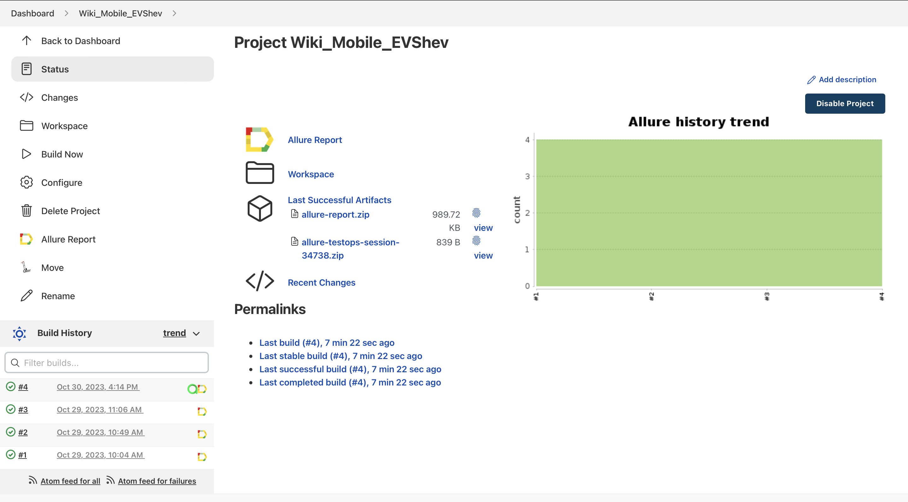
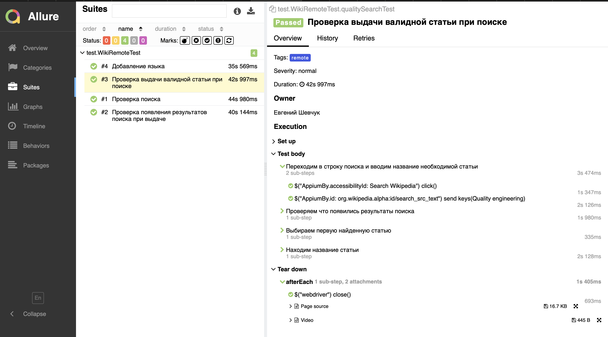
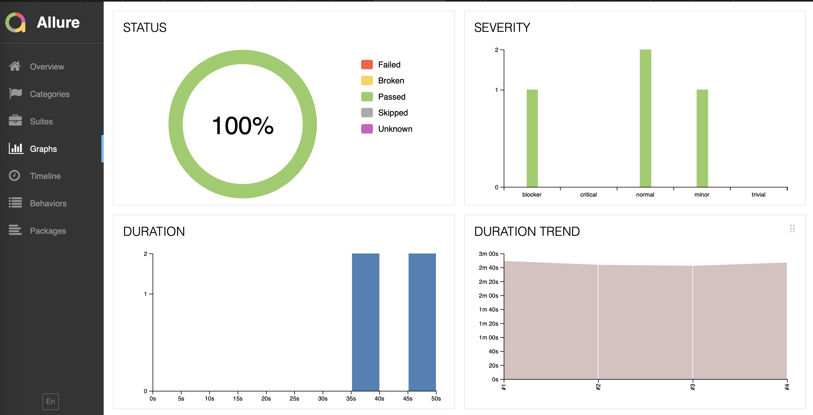
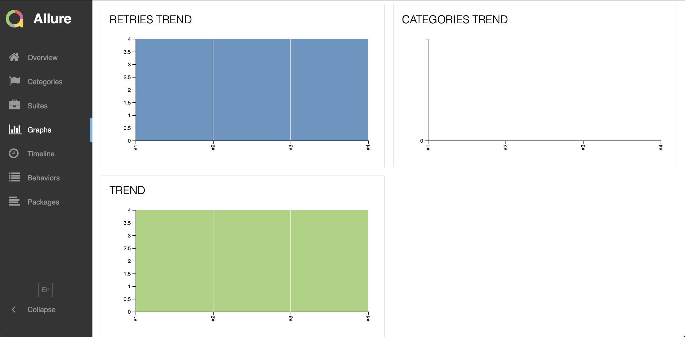
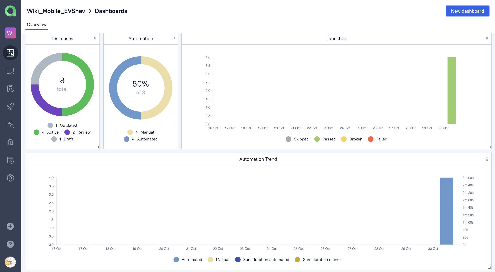
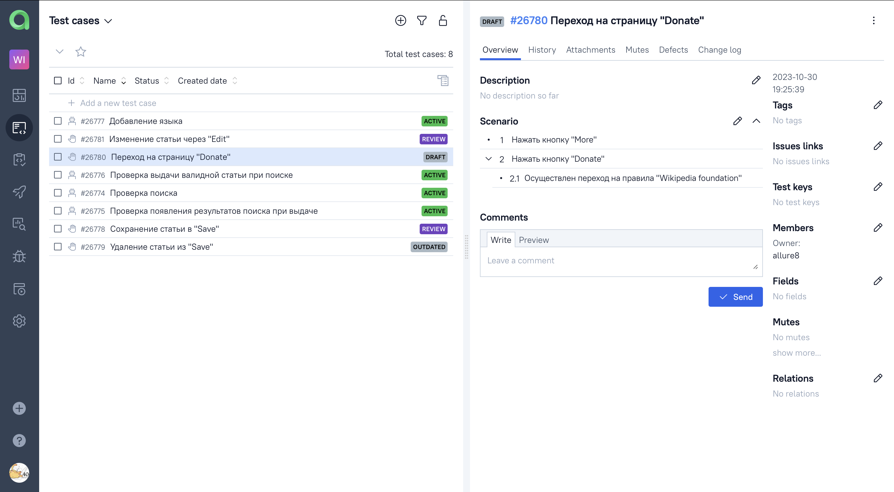
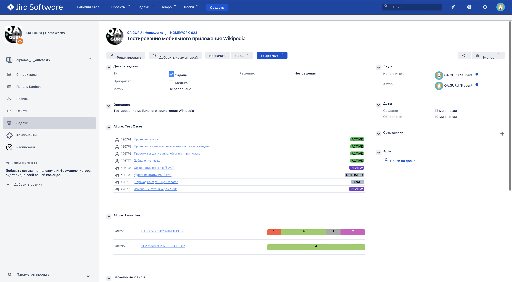
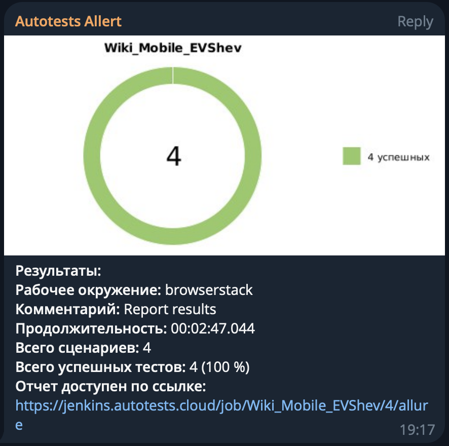
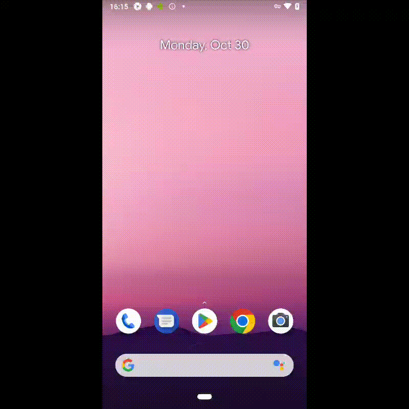

<h1 >Проект по автоматизации тестирования мобильного приложения <a href="https://github.com/wikimedia/apps-android-wikipedia/">Wikipedia</a></h1>

<p align="center">  
</a>  
</p>

# 🧾 Содержание:

- <a href="#tools">Технологии и инструменты</a>
- <a href="#checking">Список проверок, реализованных в автоматизированных тест-кейсах</a>
- <a href="#jenkins">Сборка в Jenkins</a>
- <a href="#console">Запуск тестов (Из терминала)</a>
- <a href="#allureReport">Allure-отчет</a>
- <a href="#allure">Интеграция с Allure TestOps</a>
- <a href="#jira">Интеграция с Jira</a>
- <a href="#tg"> Уведомление в Telegram о результатах выполнения автоматизированных тестов</a>
- <a href="#movie">Видеопример прохождения тестов Browserstack</a>

<a id="tools"></a>

## 🔨 Технологии и инструменты:

| Java                                                                                                    | IntelliJ  <br>  Idea                                                                                               | GitHub                                                                                                     | JUnit 5                                                                                                          | Gradle                                                                                                    | Allure <br> Report                                                                                                        | Appium                                                                                                   | Browserstack                                                                                                                   | Jenkins                                                                                                         | Jira                                                                                                                                  | Telegram                                                                                                         |                                                                                            Allure <br> TestOps |
|:--------------------------------------------------------------------------------------------------------|--------------------------------------------------------------------------------------------------------------------|------------------------------------------------------------------------------------------------------------|------------------------------------------------------------------------------------------------------------------|----------------------------------------------------------------------------------------------------------------------------------------------------------------------------------------------------------------------------|---------------------------------------------------------------------------------------------------------------------------|----------------------------------------------------------------------------------------------------------|--------------------------------------------------------------------------------------------------------------------------------|-----------------------------------------------------------------------------------------------------------------|---------------------------------------------------------------------------------------------------------------------------------------|------------------------------------------------------------------------------------------------------------------|---------------------------------------------------------------------------------------------------------------:|
| <a href="https://www.java.com/"></a> | <a href="https://www.jetbrains.com/idea/"></a> | <a href="https://github.com/"></a> | <a href="https://junit.org/junit5/"></a> | <a href="https://gradle.org/"></a>  | <a href="https://github.com/allure-framework"></a> | <a href="https://appium.io//"></a> | <a href="https://www.browserstack.com/"></a> | <a href="https://www.jenkins.io/"></a> | <a href="https://www.atlassian.com/software/jira/"></a> | <a href="https://web.telegram.org/"></a> | <a href="https://qameta.io/"></a> |

<a id="checking"></a>

## 🏁 Реализованные проверки:

### При запуске локально (local):

- Проверка появления результатов поиска при выдаче
- Проверка 4 стартовых страниц wiki
- Проверка присутствия кнопки логина на странице при переходе через edits
- Проверка поиска конкретной статьи
- Проверка добавления и удаления языка

### При запуске удаленно (remote):

- Проверка появления результатов поиска при выдаче
- Проверка поиска
- Проверка выдачи валидной статьи при поиске
- Добавление языка

<a id="jenkins"></a>
##  Сборка в [Jenkins](https://jenkins.autotests.cloud/job/Wiki_Mobile_EVShev/)

<p align="center">  
</a>  
</p>

## 🚀 Команда для запуска автотестов из терминала

Запуск локально (local) на эмуляторе:

```bash  
gradle clean local_test -DdeviceHost=local
```

> Внимание! Для запуска локальных тестов на компьютере должны быть установлены Android Studio, Appium Server и Appium

Запуск удаленно (remote) на Browserstack:

```bash  
gradle clean remote_test -DdeviceHost=remote
```

> Для запуска необходимо нажать "Build now"

<a id="allureReport"></a>
##  </a>Интеграция с <a target="_blank" href="https://jenkins.autotests.cloud/job/Wiki_Mobile_EVShev/4/allure/">Allure Report</a>

## 🖨️ Основная страница отчёта

<p align="center">  
  
</p>  

## 📄 Тест-кейсы

<p align="center">  
   
</p>

## 📊 Графики

<p align="center">   
  
  
</p>

<a id="allure"></a>
##  </a>Интеграция с <a target="_blank" href="https://allure.autotests.cloud/project/3734/dashboards">Allure TestOps</a>

## 🖨️ Основная страница отчёта

<p align="center">  
  
</p>  

## 📄 Авто и Ручные тест-кейсы

<p align="center">  
  
</p>

<a id="jira"></a>
## </a> Интеграция с <a target="_blank" href="https://jira.autotests.cloud/browse/HOMEWORK-923">Jira</a>

<p align="center">  
  
</p>

____
<a id="tg"></a>
## </a> Уведомление в Telegram при помощи бота

____
<p align="center">  
  
</p>

____
<a id="movie"></a>
## </a> Видеопример выполнения теста Browserstack

____
<p align="center">
   
</p>

